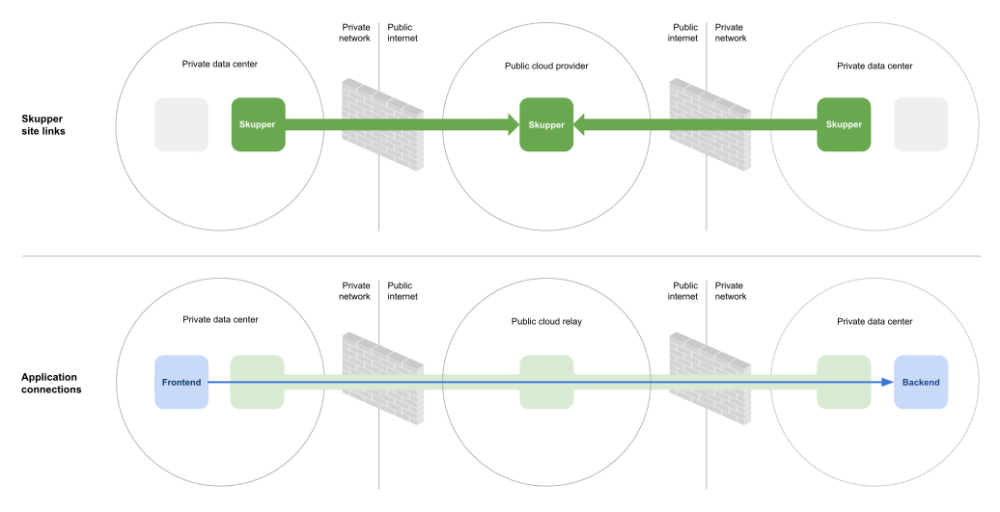

# Skupper Hello World private to private

#### Connect services in isolated on-prem sites

This example is part of a [suite of examples][examples] showing the
different ways you can use [Skupper][website] to connect services
across cloud providers, data centers, and edge sites.

[website]: https://skupper.io/
[examples]: https://skupper.io/examples/index.html

#### Contents

* [Overview](#overview)
* [Prerequisites](#prerequisites)
* [Step 1: Install the Skupper command-line tool](#step-1-install-the-skupper-command-line-tool)
* [Step 2: Set up your namespaces](#step-2-set-up-your-namespaces)
* [Step 3: Deploy the frontend and backend](#step-3-deploy-the-frontend-and-backend)
* [Step 4: Create your sites](#step-4-create-your-sites)
* [Step 5: Link your sites](#step-5-link-your-sites)
* [Step 6: Expose the backend](#step-6-expose-the-backend)
* [Step 7: Access the frontend](#step-7-access-the-frontend)
* [Cleaning up](#cleaning-up)
* [Summary](#summary)
* [Next steps](#next-steps)
* [About this example](#about-this-example)

## Overview

This example is a basic multi-service HTTP application deployed
across two Kubernetes clusters, each in its own private data center.

It contains two services:

* A backend service that exposes an `/api/hello` endpoint.  It
  returns greetings of the form `Hi, <your-name>.  I am <my-name>
  (<pod>)`.

* A frontend service that connects to the backend.  It sends
  greetings to the backend and fetches new greetings in response.

The backend service runs in on-prem cluster "private1", and the
frontend service runs in on-prem cluster "private2".  The private
sites are linked by a relay site in the public cloud.  Skupper
enables the frontend to connect to the backend over a secure
dedicated application network.

## Prerequisites

* The `kubectl` command-line tool, version 1.15 or later
  ([installation guide][install-kubectl])

* Access to at least one Kubernetes cluster, from [any provider you
  choose][kube-providers]

[install-kubectl]: https://kubernetes.io/docs/tasks/tools/install-kubectl/
[kube-providers]: https://skupper.io/start/kubernetes.html

## Step 1: Install the Skupper command-line tool

This example uses the Skupper command-line tool to deploy Skupper.
You need to install the `skupper` command only once for each
development environment.

On Linux or Mac, you can use the install script (inspect it
[here][install-script]) to download and extract the command:

~~~ shell
curl https://skupper.io/install.sh | sh
~~~

The script installs the command under your home directory.  It
prompts you to add the command to your path if necessary.

For Windows and other installation options, see [Installing
Skupper][install-docs].

[install-script]: https://github.com/skupperproject/skupper-website/blob/main/input/install.sh
[install-docs]: https://skupper.io/install/

## Step 2: Set up your namespaces

Skupper is designed for use with multiple Kubernetes namespaces,
usually on different clusters.  The `skupper` and `kubectl`
commands use your [kubeconfig][kubeconfig] and current context to
select the namespace where they operate.

[kubeconfig]: https://kubernetes.io/docs/concepts/configuration/organize-cluster-access-kubeconfig/

Your kubeconfig is stored in a file in your home directory.  The
`skupper` and `kubectl` commands use the `KUBECONFIG` environment
variable to locate it.

A single kubeconfig supports only one active context per user.
Since you will be using multiple contexts at once in this
exercise, you need to create distinct kubeconfigs.

For each namespace, open a new terminal window.  In each terminal,
set the `KUBECONFIG` environment variable to a different path and
log in to your cluster.  Then create the namespace you wish to use
and set the namespace on your current context.

**Note:** The login procedure varies by provider.  See the
documentation for yours:

* [Minikube](https://skupper.io/start/minikube.html#cluster-access)
* [Amazon Elastic Kubernetes Service (EKS)](https://skupper.io/start/eks.html#cluster-access)
* [Azure Kubernetes Service (AKS)](https://skupper.io/start/aks.html#cluster-access)
* [Google Kubernetes Engine (GKE)](https://skupper.io/start/gke.html#cluster-access)
* [IBM Kubernetes Service](https://skupper.io/start/ibmks.html#cluster-access)
* [OpenShift](https://skupper.io/start/openshift.html#cluster-access)

_**Private 1:**_

~~~ shell
export KUBECONFIG=~/.kube/config-private1
# Enter your provider-specific login command
kubectl create namespace private1
kubectl config set-context --current --namespace private1
~~~

_**Private 2:**_

~~~ shell
export KUBECONFIG=~/.kube/config-private2
# Enter your provider-specific login command
kubectl create namespace private2
kubectl config set-context --current --namespace private2
~~~

_**Relay:**_

~~~ shell
export KUBECONFIG=~/.kube/config-relay
# Enter your provider-specific login command
kubectl create namespace relay
kubectl config set-context --current --namespace relay
~~~

## Step 3: Deploy the frontend and backend

This example runs the frontend and the backend in separate
Kubernetes namespaces, on different clusters.

Use `kubectl create deployment` to deploy the frontend in
namespace `private1` and the backend in namespace
`private2`.

_**Private 1:**_

~~~ shell
kubectl create deployment frontend --image quay.io/skupper/hello-world-frontend
~~~

_**Private 2:**_

~~~ shell
kubectl create deployment backend --image quay.io/skupper/hello-world-backend --replicas 3
~~~

## Step 4: Create your sites

A Skupper _site_ is a location where components of your
application are running.  Sites are linked together to form a
network for your application.  In Kubernetes, a site is associated
with a namespace.

For each namespace, use `skupper init` to create a site.  This
deploys the Skupper router and controller.  Then use `skupper
status` to see the outcome.

**Note:** If you are using Minikube, you need to [start minikube
tunnel][minikube-tunnel] before you run `skupper init`.

[minikube-tunnel]: https://skupper.io/start/minikube.html#running-minikube-tunnel

_**Private 1:**_

~~~ shell
skupper init
skupper status
~~~

_Sample output:_

~~~ console
$ skupper init
Waiting for LoadBalancer IP or hostname...
Waiting for status...
Skupper is now installed in namespace 'private1'.  Use 'skupper status' to get more information.

$ skupper status
Skupper is enabled for namespace "private1". It is not connected to any other sites. It has no exposed services.
~~~

_**Private 2:**_

~~~ shell
skupper init
skupper status
~~~

_Sample output:_

~~~ console
$ skupper init
Waiting for LoadBalancer IP or hostname...
Waiting for status...
Skupper is now installed in namespace 'private2'.  Use 'skupper status' to get more information.

$ skupper status
Skupper is enabled for namespace "private2". It is not connected to any other sites. It has no exposed services.
~~~

_**Relay:**_

~~~ shell
skupper init
skupper status
~~~

_Sample output:_

~~~ console
$ skupper init
Waiting for LoadBalancer IP or hostname...
Waiting for status...
Skupper is now installed in namespace 'relay'.  Use 'skupper status' to get more information.

$ skupper status
Skupper is enabled for namespace "relay". It is not connected to any other sites. It has no exposed services.
~~~

As you move through the steps below, you can use `skupper status` at
any time to check your progress.

## Step 5: Link your sites

A Skupper _link_ is a channel for communication between two sites.
Links serve as a transport for application connections and
requests.

Creating a link requires use of two `skupper` commands in
conjunction, `skupper token create` and `skupper link create`.

The `skupper token create` command generates a secret token that
signifies permission to create a link.  The token also carries the
link details.  Then, in a remote site, The `skupper link
create` command uses the token to create a link to the site
that generated it.

**Note:** The link token is truly a *secret*.  Anyone who has the
token can link to your site.  Make sure that only those you trust
have access to it.

First, use `skupper token create` in site Private 1 to generate the
token.  Then, use `skupper link create` in site Private 2 to link
the sites.

_**Relay:**_

~~~ shell
skupper token create ~/relay1.token
skupper token create ~/relay2.token
~~~

_Sample output:_

~~~ console
$ skupper token create ~/relay1.token
Token written to ~/relay1.token

$ skupper token create ~/relay2.token
Token written to ~/relay2.token
~~~

_**Private 1:**_

~~~ shell
skupper link create ~/relay1.token
~~~

_Sample output:_

~~~ console
$ skupper link create ~/relay1.token
Site configured to link to https://10.106.89.17:8081/76f8f557-ccd2-11ee-865d-04421a4c5042 (name=link1)
Check the status of the link using 'skupper link status'.
~~~

_**Private 2:**_

~~~ shell
skupper link create ~/relay2.token
~~~

_Sample output:_

~~~ console
$ skupper link create ~/relay2.token
Site configured to link to https://10.106.89.17:8081/775fb7d6-ccd2-11ee-aab9-04421a4c5042 (name=link1)
Check the status of the link using 'skupper link status'.
~~~

If your terminal sessions are on different machines, you may need
to use `scp` or a similar tool to transfer the token securely.  By
default, tokens expire after a single use or 15 minutes after
creation.

## Step 6: Expose the backend

We now have our sites linked to form a Skupper network, but no
services are exposed on it.  Skupper uses the `skupper expose`
command to select a service from one site for exposure in all the
linked sites.

Use `skupper expose` to expose the backend service in Private 2 to
the frontend in Private 1.

_**Private 2:**_

~~~ shell
skupper expose deployment/backend --port 8080
~~~

_Sample output:_

~~~ console
$ skupper expose deployment/backend --port 8080
deployment backend exposed as backend
~~~

## Step 7: Access the frontend

In order to use and test the application, we need external access
to the frontend.

Use `kubectl expose` with `--type LoadBalancer` to open network
access to the frontend service.

Once the frontend is exposed, use `kubectl get service/frontend`
to look up the external IP of the frontend service.  If the
external IP is `<pending>`, try again after a moment.

Once you have the external IP, use `curl` or a similar tool to
request the `/api/health` endpoint at that address.

**Note:** The `<external-ip>` field in the following commands is a
placeholder.  The actual value is an IP address.

_**Private 1:**_

~~~ shell
kubectl expose deployment/frontend --port 8080 --type LoadBalancer
kubectl get service/frontend
curl http://<external-ip>:8080/api/health
~~~

_Sample output:_

~~~ console
$ kubectl expose deployment/frontend --port 8080 --type LoadBalancer
service/frontend exposed

$ kubectl get service/frontend
NAME       TYPE           CLUSTER-IP      EXTERNAL-IP     PORT(S)          AGE
frontend   LoadBalancer   10.103.232.28   <external-ip>   8080:30407/TCP   15s

$ curl http://<external-ip>:8080/api/health
OK
~~~

If everything is in order, you can now access the web interface by
navigating to `http://<external-ip>:8080/` in your browser.

## Cleaning up

To remove Skupper and the other resources from this exercise, use
the following commands:

_**Private 1:**_

~~~ shell
skupper delete
kubectl delete service/frontend
kubectl delete deployment/frontend
~~~

_**Relay:**_

~~~ shell
skupper delete
~~~

_**Private 2:**_

~~~ shell
skupper delete
kubectl delete deployment/backend
~~~

## Next steps

Check out the other [examples][examples] on the Skupper website.

## About this example

This example was produced using [Skewer][skewer], a library for
documenting and testing Skupper examples.

[skewer]: https://github.com/skupperproject/skewer

Skewer provides utility functions for generating the README and
running the example steps.  Use the `./plano` command in the project
root to see what is available.

To quickly stand up the example using Minikube, try the `./plano demo`
command.
